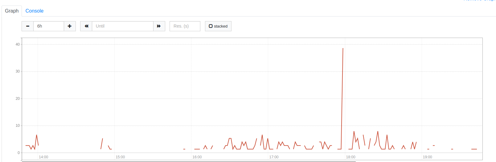

##Alert

```sh
  - alert: MysqlTransactionDeadlock
    expr: increase(mysql_global_status_innodb_row_lock_waits[2m]) > 0
    for: 3m
    labels:
      severity: warning
    annotations:
      dashboard: database-metrics
      summary: 'Mysql Transaction Waits'
    description: 'There are `{{ $value | humanize }}` MySQL connections waiting for a stale transaction to release.'
```

##Graph



## What Each Line Means

| Line                                                                                       | Explanation                                                                                                                                                                                                 |
|--------------------------------------------------------------------------------------------|-------------------------------------------------------------------------------------------------------------------------------------------------------------------------------------------------------------|
| `- alert: MysqlTransactionDeadlock`                                                       | Defines the unique name of the alert. Helps Prometheus and Alertmanager identify and reference it.                                                                                                          |
| `expr: increase(mysql_global_status_innodb_row_lock_waits[2m]) > 0`                        | Triggers the alert if the number of InnoDB row lock waits has increased in the last 2 minutes. A value greater than 0 means at least one transaction has been blocked.                                      |
| `for: 3m`                                                                                  | Ensures the alert only fires if the condition stays true for 3 consecutive minutes. Reduces noise from short-lived spikes.                                                                                  |
| `labels:`                                                                                  | Metadata used to help organize, route, and filter alerts.                                                                                                                                                   |
| `severity: warning`                                                                       | Classifies this alert as a warning (non-critical but worth checking). Useful for routing alerts to the right notification channel.                                                                          |
| `annotations:`                                                                             | Human-readable context shown in dashboards and alerts.                                                                                                                                                      |
| `dashboard: database-metrics`                                                             | Refers to the name or ID of the related Grafana dashboard where metrics can be explored.                                                                                                                    |
| `summary: 'Mysql Transaction Waits'`                                                      | A short, descriptive title for the alert. Ideal for use in notifications or dashboard alert tables.                                                                                                         |
|  description:       ...                                                                      | Provides a clear explanation of the alert and includes dynamic data (e.g., how many connections are affected). Helps responders quickly understand the issue.                                 |

🔍 How to Investigate the Reason for the Alert

The alert is based on this PromQL expression:

increase(mysql_global_status_innodb_row_lock_waits[2m]) > 0

This tells us that at least one InnoDB transaction had to wait for a row lock in the last 2 minutes.
## Root Cause Investigation Steps
Step	Tool / Query	Purpose
1	SHOW ENGINE INNODB STATUS\G	Displays InnoDB internal engine report. Look for LATEST DETECTED DEADLOCK and TRANSACTIONS.
2	SELECT * FROM information_schema.innodb_locks;	Shows row-level locks currently held by active transactions.
3	SELECT * FROM information_schema.innodb_lock_waits;	Shows which transactions are waiting on locks held by others.
4	SELECT * FROM information_schema.innodb_trx;	Displays active transactions, their age, state, and running queries.
## innodb_locks

SELECT * FROM information_schema.innodb_locks;

SELECT *	#Selects all columns (lock details).
FROM information_schema.innodb_locks;	#Lists all row locks currently held by InnoDB transactions.

    Use Case: Identifies which transactions are blocking others by holding locks on rows or indexes.


Sample Output

lock_id   | lock_trx_id | lock_mode | lock_type | lock_table  | lock_index | lock_data
----------|-------------|-----------|-----------|-------------|------------|----------
123456    | 98765       | X         | RECORD    | db.orders   | PRIMARY    | 101

    lock_trx_id: Transaction holding the lock

    lock_mode: Lock type (X = exclusive, S = shared)

    lock_data: The locked row key or identifier


## innodb_lock_waits

SELECT * FROM information_schema.innodb_lock_waits;

SELECT *	#Selects all columns showing lock wait relationships.
FROM information_schema.innodb_lock_waits;	#Shows which transaction is waiting on which lock and who’s blocking it.

    Use Case: Helps you see which transactions are blocked, and by whom.

Sample Output

requesting_trx_id | requested_lock_id | blocking_trx_id | blocking_lock_id
------------------|-------------------|------------------|------------------
98766             | lock567           | 98765            | lock123

    requesting_trx_id: Transaction waiting on a lock

    blocking_trx_id: Transaction holding the lock

innodb_trx

SELECT * FROM information_schema.innodb_trx;


SELECT *	#Selects all columns showing active transactions.

FROM information_schema.innodb_trx;	 #Displays all currently running InnoDB transactions, including query text and timestamps.

    Use Case: Find long-running or idle transactions, and see what SQL they’re running.

Sample Output

trx_id | trx_state  | trx_started         | trx_mysql_thread_id | trx_query
-------|------------|---------------------|----------------------|------------------------------------------------------
98765  | RUNNING    | 2025-04-04 14:05:00 | 234                  | UPDATE orders SET status='shipped' WHERE id = 101
98766  | LOCK WAIT  | 2025-04-04 14:05:03 | 235                  | UPDATE orders SET status='shipped' WHERE id = 102

## To debug a deadlock or long wait:

    Start with innodb_lock_waits
    → See who is waiting and who is blocking.

    Use innodb_locks
    → Inspect what locks are involved (on which table/index/row).

    Use innodb_trx
    → Trace back to actual SQL query, start time, and connection ID.
