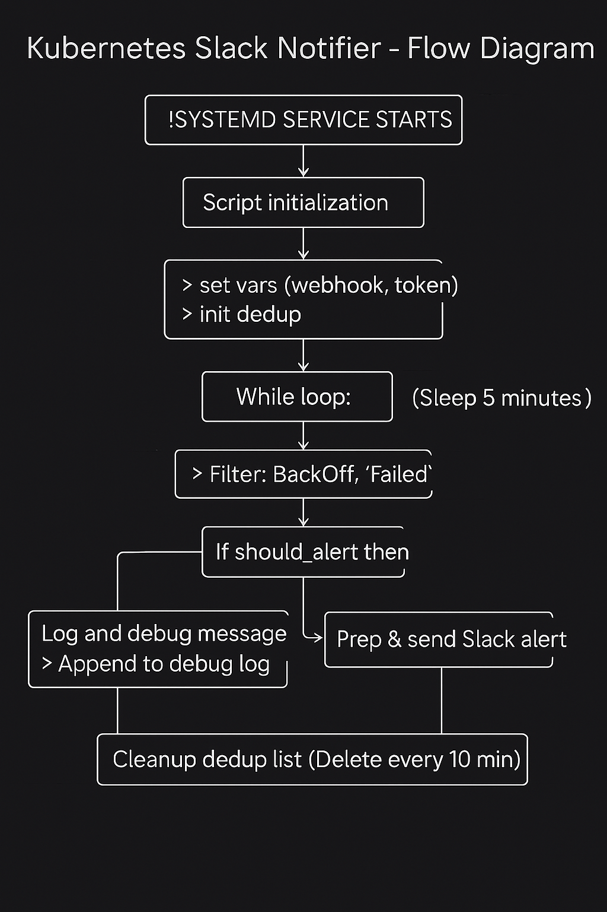

## Files Description

| File Name                        | Description                                                                 |
|----------------------------------|-----------------------------------------------------------------------------|
| `bad-image-pod.yaml`            | Kubernetes manifest that intentionally triggers an image pull failure, used for testing alerts |
| `pod_image_failure_notifier.sh` | **Main script** that polls Kubernetes events for pod failures and sends deduplicated Slack alerts |
| `k8s_last_alerts.log`           | Cache file storing event UIDs and timestamps to suppress duplicate alerts within a time window |
| `k8s-slack-notifier-debug.log` | Debug log output from the notifier script, containing event processing and Slack response details |
| `k8s-slack-notifier.service`   | systemd unit file to manage the notifier script as a background service, ensuring it runs continuously |
| `k8s-slack-notifier`           | **Logrotate config** for rotating `k8s-slack-notifier-debug.log` daily; restarts the service after rotation |

## Kubernetes Slack Notifier – Flow Diagram

